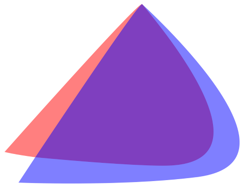
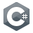

	<h1>Hello, I am WeizenMehl</h1>

	<h2>Operating Systems I use</h2>

    
    
	<h4>EndeavourOS</h4>
    

            I primarily use EndeavourOS, a lightweight and fast GNU/Linux distribution with a rolling release model.
            I choose it for its reliability, performance, and security. It's my go-to system for personal use and most
            of my school work, especially coding projects.
    

	<h4>Windows</h4>
        

            I use Windows only when necessary for school or work—typically in situations where GNU/Linux isn't supported
            or Windows is required by default.
        

 

	<h2>Programming Languages</h2>

	
	
	
	

  <h2>Statistic</h2>
  
   
  

